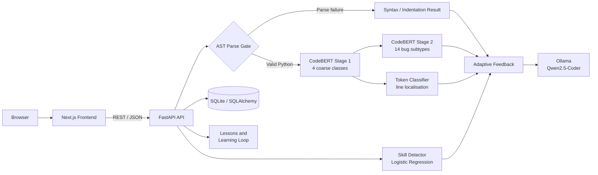

# PyTutor: AI-Based Personalised Programming Tutor

> A full-stack educational system that analyses Python source code, classifies and localises defects, estimates the learner's experience level, generates role-adaptive feedback, and reinforces learning through targeted lessons and spaced repetition.

**BSc Computer Science Final Year Project**

**Author:** Nguyen Ngoc Gia Han

**Repository:** [Heulwen-in/ai-code-tutor](https://github.com/Heulwen-in/ai-code-tutor)

## Table of Contents

- [Project Overview](#project-overview)
- [Core Capabilities](#core-capabilities)
- [System Architecture](#system-architecture)
- [Technology Stack](#technology-stack)
- [Model Design and Results](#model-design-and-results)
- [Repository Structure](#repository-structure)
- [Getting Started](#getting-started)
- [Configuration](#configuration)
- [API Overview](#api-overview)
- [Reproducing the ML Pipeline](#reproducing-the-ml-pipeline)
- [Current Limitations](#current-limitations)

## Project Overview

PyTutor is a web-based personalised programming tutor for Python learners and professional developers. A submitted code snippet passes through a hierarchical analysis pipeline that combines deterministic parsing with fine-tuned CodeBERT models. The resulting defect classification, skill estimate, and line location are supplied to a local large language model, which generates feedback appropriate to the user's selected role.

The system supports two feedback profiles:

- **Student:** explanatory, beginner-oriented guidance that encourages the learner to identify and correct the issue without receiving a complete solution.
- **Worker:** concise, technically detailed feedback focused on defect impact, verification, and professional practice.

Unlike a standalone classifier, PyTutor incorporates an educational learning loop. Analyses can be stored against authenticated accounts, relevant lessons are recommended, achievements are derived from activity, and recurring weaknesses are scheduled for review using Leitner-style spaced repetition.

## Core Capabilities

- **Hybrid defect analysis:** Python `ast.parse` detects syntax and indentation failures before neural inference.
- **Hierarchical CodeBERT classification:** Stage 1 predicts a coarse class and Stage 2 refines detected defects into one of 14 subtypes.
- **Bug-line localisation:** a token-classification head estimates the most likely defective line.
- **Clean-code recognition:** `no_bug` is represented as a trained Stage 1 class, with confidence-based abstention for uncertain predictions.
- **Skill estimation:** a Logistic Regression model infers `novice` or `professional` from behavioural code features.
- **Adaptive AI feedback:** Qwen2.5-Coder runs locally through Ollama and adapts its response to the selected role and inferred skill level.
- **Targeted learning content:** lessons cover syntax, indentation, logic, variable usage, testing, static analysis, and debugging practice.
- **User accounts:** FastAPI provides registration, OAuth2 password login, and JWT-protected profile operations.
- **Progress tracking:** analyses, lesson completion, learning points, streaks, skill trends, and achievements are persisted in SQLAlchemy.
- **Spaced repetition:** recurring bug categories enter a `1 → 3 → 7 → 14` day review schedule.
- **Mock-first demonstration:** the frontend can operate without the backend or large model artefacts.
- **Transparent methodology:** the `/process` page presents the datasets, leakage controls, model pipeline, evaluation results, and limitations.

## System Architecture



### Inference Sequence

1. The API validates that the submission contains Python code.
2. The AST gate returns exact syntax or indentation diagnostics when parsing fails.
3. For valid Python, Stage 1 predicts `syntax_error`, `logic_error`, `variable_misuse`, or `no_bug`.
4. Stage 2 refines a detected defect into a fine-grained subtype, subject to a confidence threshold.
5. The line-localisation model predicts the most likely defective line.
6. The skill detector evaluates behavioural and structural coding characteristics.
7. Ollama generates role-adaptive feedback, while the recommender selects relevant lessons.
8. The analysis and associated learning state are persisted for registered users.

### Application-Facing Bug Classes

| Class | Responsibility |
|---|---|
| `syntax_error` | Invalid Python syntax; detected by the AST gate or Stage 1 |
| `indentation_error` | Invalid indentation; detected deterministically by the AST gate |
| `logic_error` | Incorrect conditions, loop behaviour, method usage, ranges, or returns |
| `variable_misuse` | Initialisation, update, naming, scope, or mutable-default defects |
| `no_bug` | No supported defect pattern detected |

## Technology Stack

| Layer | Technologies |
|---|---|
| Frontend | Next.js 14, React 18, TypeScript, Recharts |
| Backend | FastAPI, Pydantic, Uvicorn |
| Persistence | SQLAlchemy, SQLite by default; configurable database URL |
| Authentication | OAuth2 password flow, JWT, Passlib/bcrypt |
| Machine learning | PyTorch, Hugging Face Transformers, CodeBERT, scikit-learn |
| Local generative AI | Ollama with Qwen2.5-Coder 7B |
| Packaging | npm, Python virtual environment, backend Dockerfile |

## Model Design and Results

### Data Strategy

The defect models and skill detector utilise separate data sources to avoid conflating correctness with experience:

- **BuggedPythonLeetCode:** injected Python defects across 14 fine-grained subtypes.
- **flytech/python-codes-25k:** stylistically diverse clean Python snippets for the `no_bug` class.
- **LeetCodeDataset:** Easy and Hard solutions used as proxy labels for novice and professional coding styles.
- **PyBugHive:** real open-source bug-fix patches retained for external generalisation evaluation.

To mitigate leakage, all mutated variants of the same original problem are assigned to a single train, validation, or test partition. The grouped split contains **2,328 unique problems**, with no problem spanning multiple partitions.

### Current v3 Results

| Component | Principal result |
|---|---:|
| Stage 1 CodeBERT, 4 coarse classes | **0.9556 macro F1** |
| Stage 2 CodeBERT, 14 subtypes | **0.9715 accuracy**, 0.9553 macro F1 |
| Bug-line localisation | **0.955 line hit@1**, 0.955 token F1 |
| Skill detector | **0.8542 macro F1** |
| Best grouped-split classical baseline, XGBoost TF-IDF | **0.8958 macro F1** |

The earlier random split produced higher scores because closely related mutated variants could occur across partitions. The v3 grouped results above supersede those leakage-inflated measurements.

### External Generalisation

On the out-of-domain PyBugHive evaluation, Stage 1 obtains **0.048 macro F1**, with approximately **94% of genuinely buggy snippets predicted as `no_bug`**. This result demonstrates a substantial synthetic-to-real domain shift. Consequently, the present model should be interpreted as an educational prototype for LeetCode-style Python snippets rather than a production-grade general-purpose defect detector.

## Repository Structure

```text
Tutor_AI_code/
├── backend/
│   ├── app/
│   │   ├── main.py                 # FastAPI application and model initialisation
│   │   ├── models/
│   │   │   ├── database.py         # SQLAlchemy entities and database setup
│   │   │   └── schemas.py          # API request and response models
│   │   ├── routers/
│   │   │   ├── analyze.py          # Code-analysis endpoint
│   │   │   ├── auth.py             # Registration and JWT login
│   │   │   ├── lessons.py          # Lesson catalogue and completion
│   │   │   └── users.py            # Profile, progress, history, and reviews
│   │   ├── services/
│   │   │   ├── bug_classifier.py   # AST gate and hierarchical classifiers
│   │   │   ├── skill_detector.py
│   │   │   ├── llm_feedback.py     # Ollama integration
│   │   │   ├── feedback_generator.py
│   │   │   ├── lesson_recommender.py
│   │   │   └── learning_loop.py
│   │   └── ml_models/              # Local model artefacts; excluded from Git
│   ├── .env.example
│   ├── requirements.txt
│   └── Dockerfile
├── frontend/
│   ├── public/process/             # Methodology diagrams and result figures
│   ├── src/app/                    # Next.js App Router pages
│   ├── src/components/             # Tutor, lesson, progress, and UI components
│   └── src/lib/                    # API, authentication, state, and shared types
├── ml_pipeline/                    # Data preparation, training, and evaluation
├── docs/                           # Design notes and report artefacts
└── README.md
```

## Getting Started

### Prerequisites

- **Python 3.11 or later**
- **Node.js 18 or later** and npm
- **Ollama** for generated feedback
- An NVIDIA GPU is recommended for training; backend inference supports CPU execution

### 1. Clone the Repository

```bash
git clone https://github.com/Heulwen-in/ai-code-tutor.git
cd ai-code-tutor
```

### 2. Configure and Run the Backend

#### Windows PowerShell

```powershell
cd backend
py -3.11 -m venv .venv
.\.venv\Scripts\Activate.ps1
python -m pip install --upgrade pip
pip install -r requirements.txt
Copy-Item .env.example .env
```

#### macOS or Linux

```bash
cd backend
python3.11 -m venv .venv
source .venv/bin/activate
python -m pip install --upgrade pip
pip install -r requirements.txt
cp .env.example .env
```

Trained model weights are intentionally excluded from Git because of their size. For an immediate development run, set the following value in `backend/.env`:

```env
USE_MOCK_BUG_CLASSIFIER=true
```

Start the API:

```bash
uvicorn app.main:app --reload --host 0.0.0.0 --port 8000
```

The API is then available at:

- Health check: <http://localhost:8000/health>
- Swagger UI: <http://localhost:8000/docs>
- ReDoc: <http://localhost:8000/redoc>

### 3. Start Local AI Feedback

Bug feedback is generated through a local Ollama instance. Install Ollama, then execute:

```bash
ollama pull qwen2.5-coder:7b
ollama serve
```

If Ollama is unavailable, classification and recommendations still execute, but the response explicitly reports that AI feedback could not be generated. A `no_bug` result uses built-in system guidance and does not require Ollama.

### 4. Configure and Run the Frontend

Open a second terminal:

```bash
cd frontend
npm install
```

Create `frontend/.env.local`:

```env
NEXT_PUBLIC_API_URL=http://localhost:8000
NEXT_PUBLIC_USE_MOCK_API=false
```

Start the development server:

```bash
npm run dev
```

Open <http://localhost:3000>.

The frontend defaults to mock analysis unless `NEXT_PUBLIC_USE_MOCK_API` is explicitly set to `false`. This permits interface demonstrations without running the backend.

### 5. Run with Real Model Artefacts

Populate `backend/app/ml_models/` with complete Hugging Face model directories, including model weights, tokenizer files, and configuration files. Configure `backend/.env` for the selected artefacts:

```env
USE_MOCK_BUG_CLASSIFIER=false
BUG_CLASSIFIER_PATH=app/ml_models/codebert_4class_v3_model
BUG_SUBTYPE_MODEL_PATH=app/ml_models/codebert_stage2_v3_model
BUG_LINE_MODEL_PATH=app/ml_models/codebert_line_detection_v3_model
SKILL_MODEL_DIR=app/ml_models
```

Stage 2 and line localisation degrade gracefully if their optional artefacts are unavailable. The primary Stage 1 model is required whenever mock mode is disabled.

## Configuration

### Backend Environment Variables

| Variable | Default | Purpose |
|---|---|---|
| `DATABASE_URL` | `sqlite:///./tutor_ai.db` | SQLAlchemy database connection |
| `SECRET_KEY` | development fallback | JWT signing secret; replace outside local development |
| `ACCESS_TOKEN_EXPIRE_MINUTES` | `60` | Access-token lifetime |
| `ALLOWED_ORIGINS` | local frontend origins | Comma-separated CORS allow-list |
| `USE_MOCK_BUG_CLASSIFIER` | `false` | Bypass heavy classifier loading |
| `BUG_CLASSIFIER_PATH` | `app/ml_models/codebert_model` | Stage 1 Hugging Face model |
| `BUG_SUBTYPE_MODEL_PATH` | `app/ml_models/codebert_stage2_model` | Stage 2 Hugging Face model |
| `BUG_LINE_MODEL_PATH` | `app/ml_models/codebert_line_detection_model` | Token-classification model |
| `SKILL_MODEL_DIR` | `app/ml_models` | Skill model and feature metadata directory |
| `ENABLE_STAGE2` | `true` | Enable fine-grained subtype inference |
| `ENABLE_LINE_DETECTION` | `true` | Enable defective-line inference |
| `NO_BUG_THRESHOLD` | `0.60` | Abstention threshold for a legacy 3-class Stage 1 model |
| `SUBTYPE_CONFIDENCE_THRESHOLD` | `0.65` | Minimum accepted Stage 2 confidence |
| `LINE_DETECTION_THRESHOLD` | `0.50` | Minimum accepted line probability |
| `OLLAMA_BASE_URL` | `http://localhost:11434` | Ollama service URL |
| `OLLAMA_MODEL` | `qwen2.5-coder:7b` | Local feedback model |
| `LLM_TIMEOUT_SECONDS` | `20` | Base feedback request timeout |

### Frontend Environment Variables

| Variable | Default | Purpose |
|---|---|---|
| `NEXT_PUBLIC_API_URL` | `http://localhost:8000` | FastAPI base URL |
| `NEXT_PUBLIC_USE_MOCK_API` | enabled unless set to `false` | Select mock or live analysis |

## API Overview

### Principal Endpoint

`POST /analyze` accepts Python code, performs the complete analysis pipeline, returns feedback and lesson recommendations, and records the analysis when a valid bearer token is supplied.

```json
{
  "code": "def total(values):\n    return sum(value)",
  "role": "student",
  "language": "python"
}
```

The response contains:

- coarse bug class, confidence, description, and estimated line;
- optional fine-grained subtype and subtype confidence;
- inferred skill level and confidence;
- adaptive feedback, next steps, tone, and feedback source;
- role-appropriate lesson recommendations.

### Endpoint Groups

| Method and path | Purpose | Authentication |
|---|---|---|
| `GET /health` | Service health check | No |
| `POST /analyze` | Analyse Python code | Optional |
| `POST /auth/register` | Create a student or worker account | No |
| `POST /auth/login` | Obtain a JWT access token | No |
| `GET /users/me` | Retrieve the current profile | Yes |
| `PATCH /users/me` | Update the display name | Yes |
| `POST /users/me/password` | Change the account password | Yes |
| `PATCH /users/me/role` | Change the feedback role | Yes |
| `GET /users/me/history` | Retrieve analysis history | Yes |
| `GET /users/me/progress` | Retrieve learning progress | Yes |
| `GET /users/me/stats` | Retrieve dashboard statistics | Yes |
| `GET /users/me/achievements` | Retrieve achievement state | Yes |
| `GET /users/me/reviews` | Retrieve spaced-repetition items | Yes |
| `GET /lessons` | List or filter lesson content | No |
| `GET /lessons/{lesson_id}` | Retrieve one lesson | No |
| `GET /lessons/recommend/{bug_type}` | Recommend lessons by bug class and role | No |
| `POST /lessons/{lesson_id}/start` | Record lesson commencement | Demo user ID |
| `POST /lessons/{lesson_id}/complete` | Record lesson completion | Demo user ID |

The interactive OpenAPI documentation at `/docs` is the authoritative source for request parameters and current schemas.

## Reproducing the ML Pipeline

The v3 workflow should be executed from the repository root in the following order:

```bash
# 1. Create leakage-controlled grouped datasets
python ml_pipeline/data_prep_grouped_v3.py

# 2. Extract the structural features used by classical baselines
python ml_pipeline/feature_extraction_v3.py

# 3. Train and evaluate classical baseline classifiers
python ml_pipeline/baseline_classifiers_v3.py

# 4. Train the hierarchical CodeBERT heads
python ml_pipeline/codebert_train_4class_v3.py
python ml_pipeline/codebert_train_stage2_v3.py
python ml_pipeline/codebert_train_line_detection_v3.py

# 5. Evaluate the coordinated v3 models
python ml_pipeline/evaluate_v3_models.py

# 6. Measure external generalisation
python ml_pipeline/pybughive_generalization_eval_v3.py
```

Dataset locations and training options are defined by the respective scripts. Full training requires the source datasets, substantial local storage, and preferably a CUDA-capable GPU. Generated model weights and Parquet datasets are excluded from version control.

Additional scripts retain earlier experiments for reproducibility, including BERT/RoBERTa comparisons, TF-IDF epoch experiments, indentation validation, LLM-provider comparison, and previous non-grouped model versions. The v3 scripts and grouped metrics should be used for the current evaluation.

## Current Limitations

- **Synthetic-to-real domain shift:** performance on PyBugHive is substantially below in-domain performance.
- **Python-only scope:** other languages require separate parsers, datasets, labels, and trained models.
- **Proxy skill labels:** LeetCode difficulty is an imperfect proxy for professional experience; skill output should be interpreted as a feedback-calibration signal.
- **Supported defect taxonomy:** `no_bug` means that no represented defect pattern was detected, not that the program is formally correct.
- **Local model requirements:** real inference requires large model artefacts that are not distributed through Git.
- **LLM availability:** generated feedback requires a running Ollama service and the configured local model.
- **Prototype persistence:** SQLite and automatic table creation are appropriate for a demonstration; production deployment would require formal migrations and hardened database configuration.
- **Authentication storage:** the frontend stores its demonstration JWT in browser local storage; a production system should employ a hardened session strategy.
- **Automated verification:** a comprehensive committed backend and frontend test suite has not yet been established.
- **Docker scope:** the repository currently provides a backend Dockerfile, not a complete Docker Compose deployment. The model directory must be populated before building a real-inference image.

## Acknowledgements

- [BuggedPythonLeetCode](https://huggingface.co/datasets/NeuroDragon/BuggedPythonLeetCode)
- [flytech/python-codes-25k](https://huggingface.co/datasets/flytech/python-codes-25k)
- [LeetCodeDataset](https://huggingface.co/datasets/newfacade/LeetCodeDataset)
- [PyBugHive](https://github.com/pybughive/pybughive)
- [microsoft/codebert-base](https://huggingface.co/microsoft/codebert-base)
- [Ollama](https://ollama.com/)
