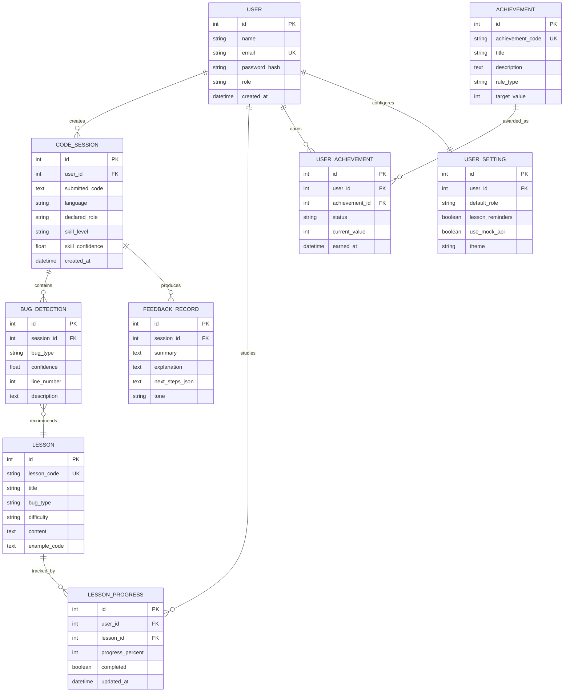

# Frontend Flow And ERD Plan

## Product Goal

CodeTutor AI is a web-based personalised programming tutor for Python learners. The frontend should
first demonstrate the complete user journey with mock data, then connect each flow to the FastAPI
backend and database.

## Environment Setup

The project uses two environments:

1. Python virtual environment (`.venv`)
   - Used for the backend and ML pipeline.
   - Runs FastAPI, CodeBERT inference, skill detector, dataset processing, and training scripts.
   - Typical backend command:

```bash
cd backend
..\.venv\Scripts\activate
uvicorn app.main:app --reload --host 0.0.0.0 --port 8000
```

2. Node.js frontend environment
   - Used only for the Next.js website.
   - This is separate from Python `.venv`.
   - Typical frontend command:

```bash
cd frontend
npm install
npm run dev
```

## Frontend Flow

1. Landing page
   - Introduces the project, ML contribution, and main feature set.
   - Primary action sends the user to authentication or dashboard demo mode.

2. Authentication
   - Login/register screen for students and professional workers.
   - Later connects to `backend/app/routers/auth.py`.

3. Dashboard
   - Main project demo screen.
   - Shows AI tutor workspace first.
   - Summarises lessons, progress, badges, and next demo milestone.

4. AI Program Tutor
   - Left panel: Python code editor.
   - Controls: role selector and analyze button.
   - Right panel: bug report, skill signal, feedback, and lesson recommendations.
   - Later connects to `POST /analyze`.

5. Lesson Learning
   - W3Schools-style modules for syntax, indentation, logic, and variable misuse.
   - Later expands into lesson detail pages, examples, quizzes, and exercises.

6. Progress Chart
   - Shows weekly improvement and analysis statistics.
   - Later uses saved `CodeSession` and `BugDetection` records.

7. Badges And Achievements
   - Shows earned, active, and locked achievements.
   - Later calculates badge state from lesson completion and analysis history.

8. Profile
   - Stores user identity, default role, and learning summary.

9. Settings
   - Stores role preference, mock/API mode, and lesson reminder preferences.

## ERD



## Step-By-Step Implementation Timeline

### Phase 1: Frontend Prototype

- Build static landing, auth, dashboard, AI tutor, lessons, progress, badges, profile, and settings pages.
- Use mock analysis responses that match the backend schema.
- Make the UI demo-ready before backend wiring.

### Phase 2: Backend Wiring

- Connect AI tutor form to `POST /analyze`.
- Add loading and error states for real API requests.
- Keep `NEXT_PUBLIC_USE_MOCK_API=true` available for fast demo fallback.

### Phase 3: Persistence

- Implement authentication and user session storage.
- Save every submitted code analysis as a `CodeSession`.
- Store bug detections, feedback, lesson recommendations, and progress.

### Phase 4: Learning Features

- Create real lesson detail pages.
- Add quizzes or exercises for each bug type.
- Update lesson progress when users finish lesson sections.

### Phase 5: Achievements

- Define achievement rules.
- Calculate badge progress from sessions and lesson completion.
- Show earned, active, and locked states in the dashboard.

### Phase 6: Final Report And Demo

- Add screenshots of every main page.
- Explain the ML pipeline, backend architecture, frontend flow, and ERD.
- Prepare scripted test cases for syntax, indentation, logic, variable misuse, and clean code.
